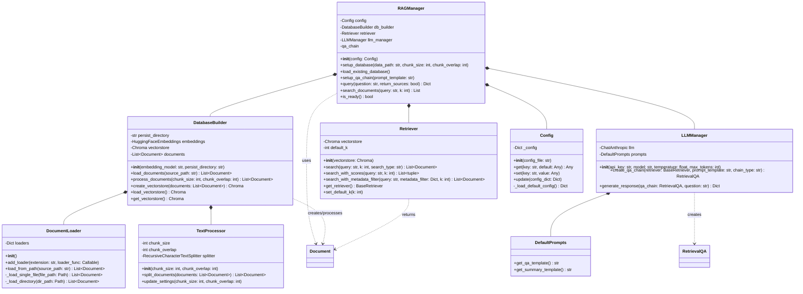
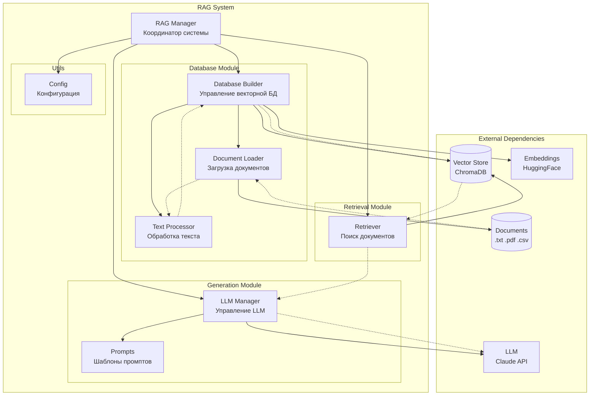
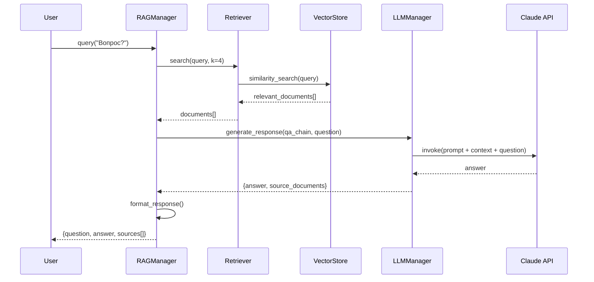
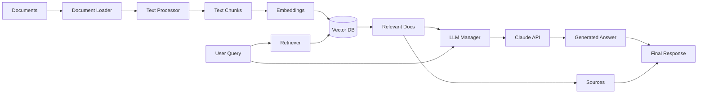

# RAG System Architecture - UML Diagram

## Class Diagram (Mermaid)

```mermaid
classDiagram
    class RAGManager {
        -Config config
        -DatabaseBuilder db_builder
        -Retriever retriever
        -LLMManager llm_manager
        -qa_chain
        +__init__(config: Config)
        +setup_database(data_path: str, chunk_size: int, chunk_overlap: int)
        +load_existing_database()
        +setup_qa_chain(prompt_template: str)
        +query(question: str, return_sources: bool) Dict
        +search_documents(query: str, k: int) List
        +is_ready() bool
    }

    class DatabaseBuilder {
        -str persist_directory
        -HuggingFaceEmbeddings embeddings
        -Chroma vectorstore
        -List~Document~ documents
        +__init__(embedding_model: str, persist_directory: str)
        +load_documents(source_path: str) List~Document~
        +process_documents(chunk_size: int, chunk_overlap: int) List~Document~
        +create_vectorstore(documents: List~Document~) Chroma
        +load_vectorstore() Chroma
        +get_vectorstore() Chroma
    }

    class DocumentLoader {
        -Dict loaders
        +__init__()
        +add_loader(extension: str, loader_func: Callable)
        +load_from_path(source_path: str) List~Document~
        -_load_single_file(file_path: Path) List~Document~
        -_load_directory(dir_path: Path) List~Document~
    }

    class TextProcessor {
        -int chunk_size
        -int chunk_overlap
        -RecursiveCharacterTextSplitter splitter
        +__init__(chunk_size: int, chunk_overlap: int)
        +split_documents(documents: List~Document~) List~Document~
        +update_settings(chunk_size: int, chunk_overlap: int)
    }

    class Retriever {
        -Chroma vectorstore
        -int default_k
        +__init__(vectorstore: Chroma)
        +search(query: str, k: int, search_type: str) List~Document~
        +search_with_scores(query: str, k: int) List~tuple~
        +search_with_metadata_filter(query: str, metadata_filter: Dict, k: int) List~Document~
        +get_retriever() BaseRetriever
        +set_default_k(k: int)
    }

    class LLMManager {
        -ChatAnthropic llm
        -DefaultPrompts prompts
        +__init__(api_key: str, model: str, temperature: float, max_tokens: int)
        +create_qa_chain(retriever: BaseRetriever, prompt_template: str, chain_type: str) RetrievalQA
        +generate_response(qa_chain: RetrievalQA, question: str) Dict
    }

    class DefaultPrompts {
        +get_qa_template() str
        +get_summary_template() str
    }

    class Config {
        -Dict _config
        +__init__(config_file: str)
        +get(key: str, default: Any) Any
        +set(key: str, value: Any)
        +update(config_dict: Dict)
        -_load_default_config() Dict
    }

    %% Relationships
    RAGManager *-- DatabaseBuilder
    RAGManager *-- Retriever
    RAGManager *-- LLMManager
    RAGManager *-- Config

    DatabaseBuilder *-- DocumentLoader
    DatabaseBuilder *-- TextProcessor

    LLMManager *-- DefaultPrompts

    %% Dependencies (uses)
    RAGManager ..> Document : uses
    DatabaseBuilder ..> Document : creates/processes
    Retriever ..> Document : returns
    LLMManager ..> RetrievalQA : creates
```

## Component Diagram

```mermaid
graph TB
    subgraph "RAG System"
        RM[RAG Manager<br/>Координатор системы]

        subgraph "Database Module"
            DB[Database Builder<br/>Управление векторной БД]
            DL[Document Loader<br/>Загрузка документов]
            TP[Text Processor<br/>Обработка текста]
        end

        subgraph "Retrieval Module"
            RT[Retriever<br/>Поиск документов]
        end

        subgraph "Generation Module"
            LM[LLM Manager<br/>Управление LLM]
            PR[Prompts<br/>Шаблоны промптов]
        end

        subgraph "Utils"
            CF[Config<br/>Конфигурация]
        end
    end

    subgraph "External Dependencies"
        VS[(Vector Store<br/>ChromaDB)]
        EM[Embeddings<br/>HuggingFace]
        AI[LLM<br/>Claude API]
        FILES[(Documents<br/>.txt .pdf .csv)]
    end

    %% Main flow
    RM --> DB
    RM --> RT
    RM --> LM
    RM --> CF

    %% Database module
    DB --> DL
    DB --> TP
    DL --> FILES
    DB --> VS
    DB --> EM

    %% Retrieval
    RT --> VS

    %% Generation
    LM --> PR
    LM --> AI

    %% Data flow
    FILES -.-> DL
    DL -.-> TP
    TP -.-> DB
    DB -.-> VS
    VS -.-> RT
    RT -.-> LM
    LM -.-> AI
```

## Sequence Diagram - Query Processing

```mermaid
sequenceDiagram
    participant User
    participant RM as RAGManager
    participant RT as Retriever
    participant VS as VectorStore
    participant LM as LLMManager
    participant AI as Claude API

    User->>RM: query("Вопрос?")

    RM->>RT: search(query, k=4)
    RT->>VS: similarity_search(query)
    VS-->>RT: relevant_documents[]
    RT-->>RM: documents[]

    RM->>LM: generate_response(qa_chain, question)
    LM->>AI: invoke(prompt + context + question)
    AI-->>LM: answer
    LM-->>RM: {answer, source_documents}

    RM->>RM: format_response()
    RM-->>User: {question, answer, sources[]}
```

## Data Flow Diagram

```mermaid
flowchart LR
    A[Documents] --> B[Document Loader]
    B --> C[Text Processor]
    C --> D[Text Chunks]
    D --> E[Embeddings]
    E --> F[(Vector DB)]

    G[User Query] --> H[Retriever]
    H --> F
    F --> I[Relevant Docs]

    I --> J[LLM Manager]
    G --> J
    J --> K[Claude API]
    K --> L[Generated Answer]

    I --> M[Sources]
    L --> N[Final Response]
    M --> N
```