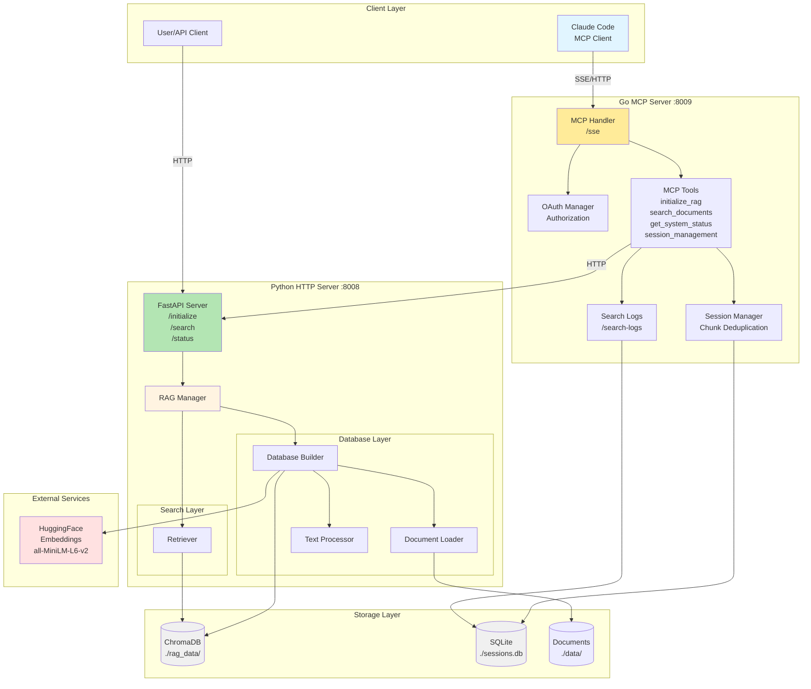
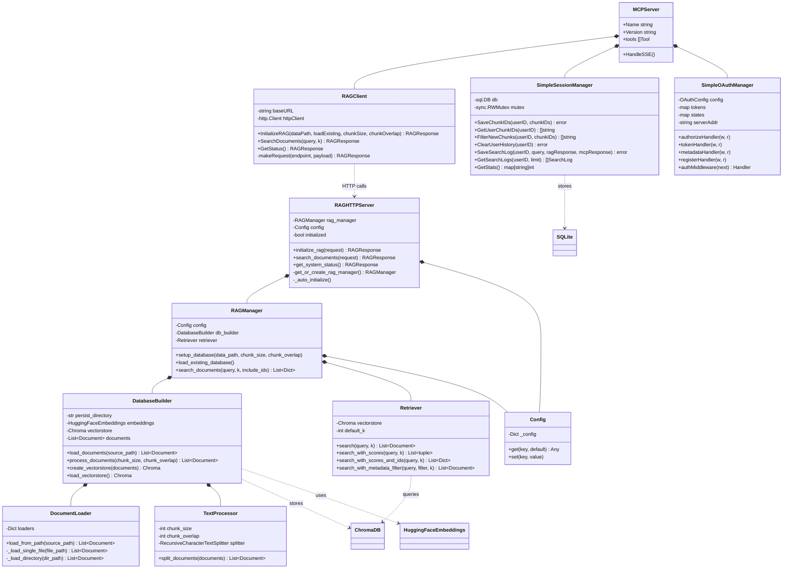
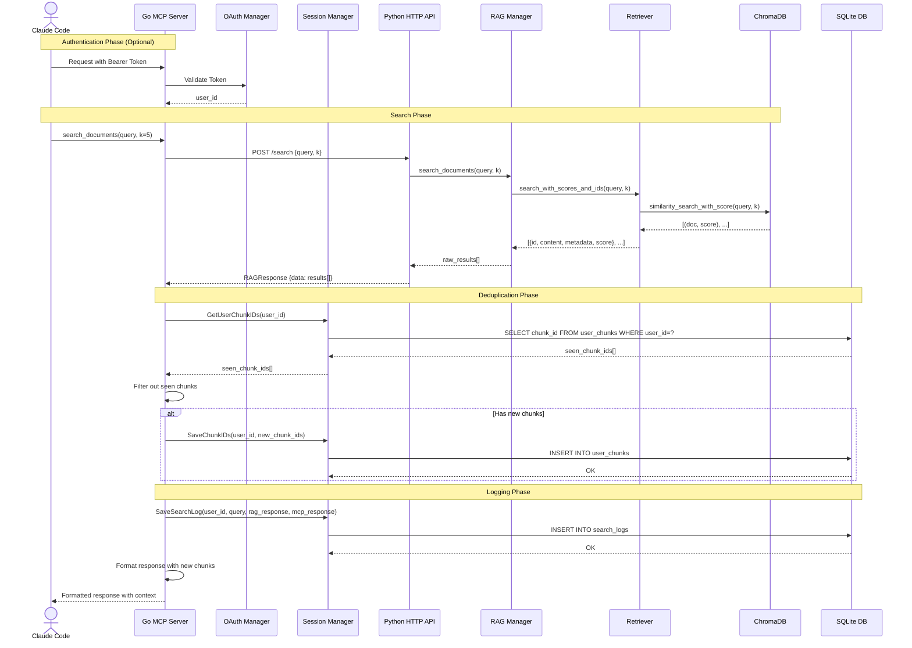
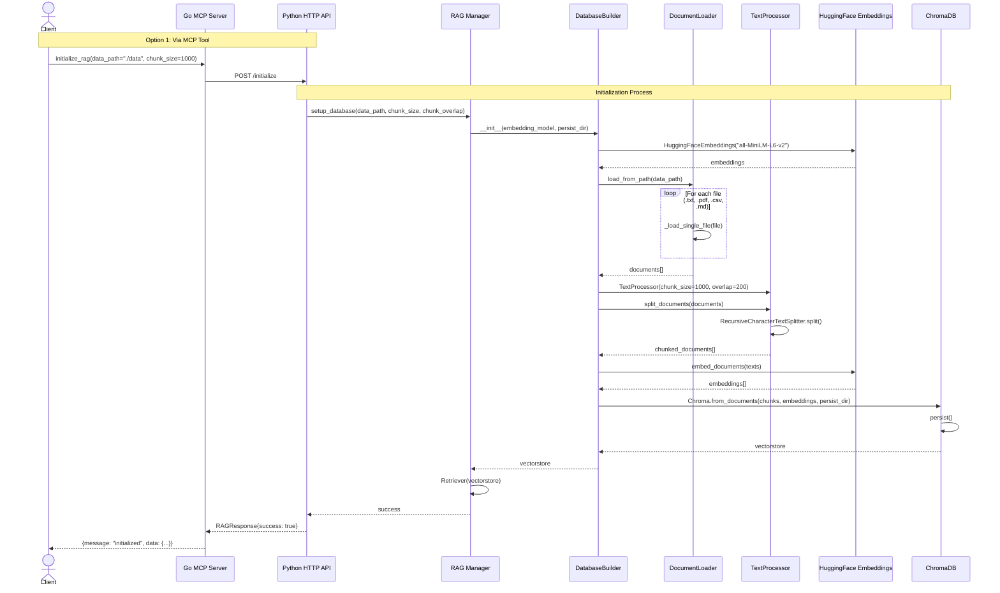
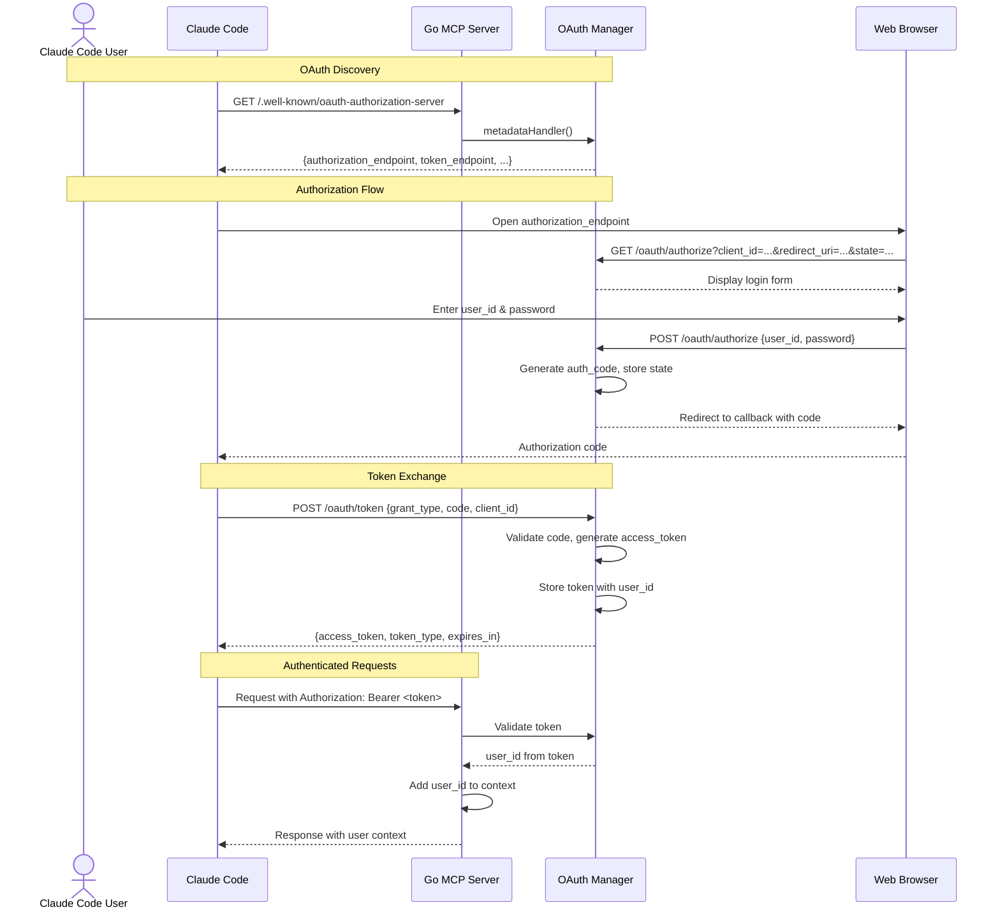
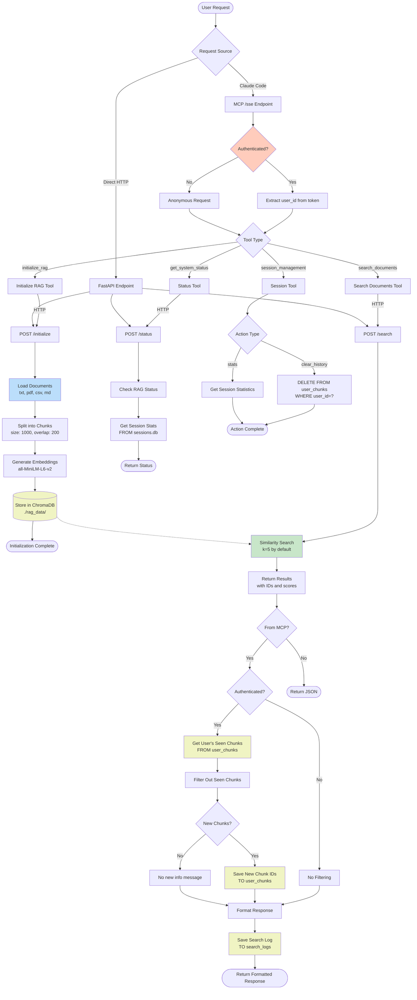
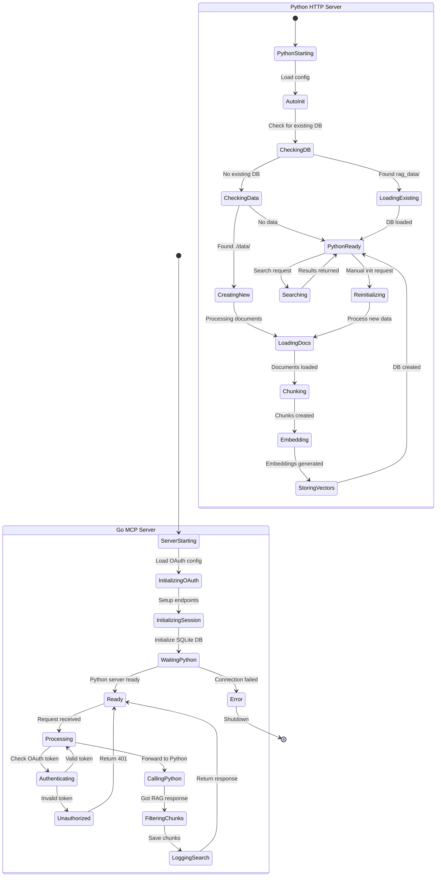
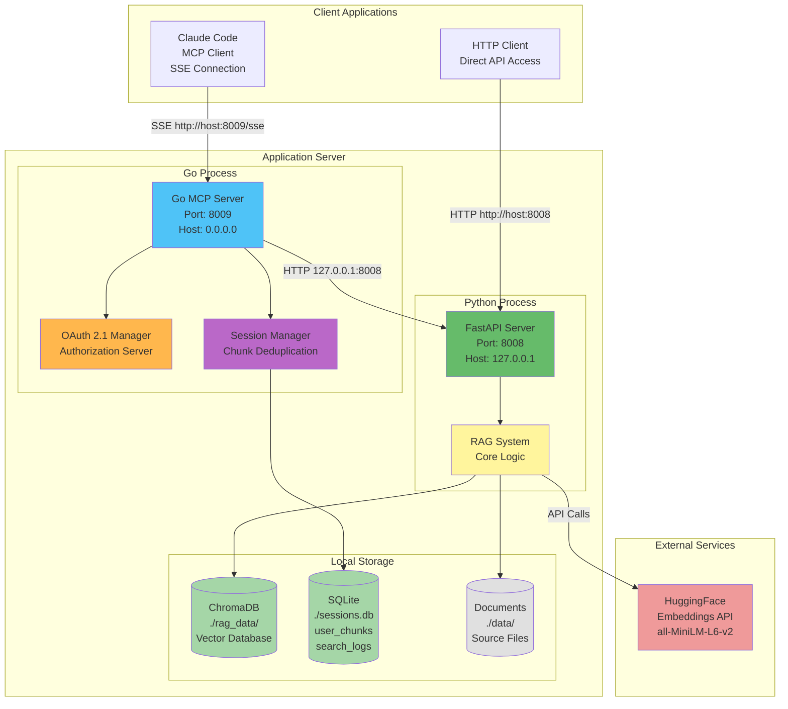

# RAG System Architecture - UML Diagrams

## Общая архитектура системы

## Component Class Diagram

## Sequence Diagram - Full Search Flow with Session Management

## Sequence Diagram - Database Initialization

## OAuth 2.1 Flow Diagram

## Data Flow Diagram

## State Diagram - System States

## Deployment Architecture

## Key Features Overview

### 1. **Dual Server Architecture**
- **Go MCP Server** (Port 8009): MCP protocol handler, OAuth 2.1, session management
- **Python HTTP Server** (Port 8008): RAG system, vector search, document processing

### 2. **OAuth 2.1 Authentication**
- MCP-compliant OAuth 2.1 implementation
- Authorization code flow with PKCE
- OAuth discovery metadata endpoints
- Dynamic client registration

### 3. **Session Management**
- **Chunk Deduplication**: Tracks which chunks user has seen
- **Search Logging**: Records all search queries and responses
- **SQLite Storage**: Persistent storage in `sessions.db`

### 4. **RAG Pipeline**
- **Document Loading**: txt, pdf, csv, md files
- **Text Processing**: 1000-char chunks with 200-char overlap
- **Vector Embeddings**: HuggingFace all-MiniLM-L6-v2
- **Vector Search**: ChromaDB with cosine similarity

### 5. **MCP Tools**
- `initialize_rag`: Setup vector database from documents
- `search_documents`: Search with deduplication and logging
- `get_system_status`: System health and statistics
- `session_management`: Clear history, get stats

### 6. **Data Flow**
1. Claude Code → Go MCP Server (with OAuth)
2. Go validates token, extracts user_id
3. Go → Python HTTP API for RAG search
4. Python returns results with chunk IDs
5. Go filters seen chunks (per user)
6. Go saves new chunks and logs search
7. Go returns formatted response to Claude
