# RAG System Architecture - Updated UML Diagrams

## 📖 Руководство по чтению диаграмм

### Типы диаграмм в документе:

#### 1. **Graph / Architecture Diagrams (Общая архитектура)**
Показывают структуру системы и связи между компонентами.

**Как читать:**
- **Прямоугольники** = компоненты/сервисы/модули
- **Стрелки** `-->` = направление взаимодействия/вызовов
- **Пунктирные стрелки** `-.->` = слабые связи (создание, использование)
- **Цилиндры** `[(...)]` = хранилища данных (базы данных)
- **Subgraph** = логические группы компонентов
- **Цвета** = категории компонентов (клиенты, серверы, хранилища и т.д.)

**Пример:**
```
CLAUDE -->|SSE/HTTP| MCP
```
Означает: Claude Code отправляет SSE/HTTP запросы к MCP серверу

---

#### 2. **Class Diagrams (Диаграммы классов)**
Показывают структуру классов, их поля, методы и взаимосвязи.

**Обозначения:**
- **+** = публичный метод/поле
- **-** = приватный метод/поле
- **~** = protected метод/поле
- **()** после имени = метод (функция)
- без скобок = поле (переменная)

**Типы связей:**
- `*--` = **композиция** (класс владеет и управляет другим объектом)
- `o--` = **агрегация** (класс содержит ссылку, но не владеет)
- `..>` = **зависимость** (класс использует другой класс)
- `--|>` = **наследование** (класс наследует другой класс)
- `--` = **ассоциация** (классы связаны)

**Пример:**
```
RAGManager *-- DatabaseBuilder
```
Означает: RAGManager владеет экземпляром DatabaseBuilder (при удалении RAGManager, DatabaseBuilder тоже удаляется)

```
RAGClient ..> RAGHTTPServer : HTTP calls
```
Означает: RAGClient зависит от RAGHTTPServer (делает к нему HTTP вызовы)

---

#### 3. **Sequence Diagrams (Диаграммы последовательности)**
Показывают порядок взаимодействия между компонентами во времени (сверху вниз).

**Как читать:**
- **Время течет сверху вниз** (первое действие вверху, последнее внизу)
- **Вертикальные линии** = объекты/компоненты
- **Горизонтальные стрелки** = сообщения/вызовы между объектами
- **Сплошная стрелка** `->` = синхронный вызов (ждет ответа)
- **Пунктирная стрелка** `-->` = ответ/возврат
- **Прямоугольники на линиях** = активация (объект выполняет работу)
- **Note over** = комментарий/пояснение
- **alt/else** = условное ветвление (если-то-иначе)
- **loop** = цикл

**Пример:**
```
User->>MCP: search_documents(query)
MCP->>HTTP: POST /search
HTTP-->>MCP: results
MCP-->>User: formatted response
```
Читается:
1. Пользователь вызывает search_documents у MCP
2. MCP делает POST запрос к HTTP серверу
3. HTTP возвращает результаты MCP
4. MCP возвращает отформатированный ответ пользователю

**alt (условие):**
```
alt Has new chunks
    MCP->>Session: SaveChunkIDs()
else No new chunks
    MCP->>MCP: Skip saving
end
```
Означает: если есть новые чанки - сохранить, иначе - пропустить

---

#### 4. **Flowchart / Data Flow Diagrams (Диаграммы потоков данных)**
Показывают путь данных через систему с точками принятия решений.

**Обозначения:**
- **Прямоугольники** `[ ]` = процессы/операции
- **Ромбы** `{ }` = точки принятия решений (if/else)
- **Скругленные прямоугольники** `([ ])` = начало/конец потока
- **Цилиндры** `[( )]` = операции с базой данных
- **Стрелки** = направление потока данных
- **Подписи на стрелках** = условия ветвления

**Как читать:**
1. Начинаете с узла `Start` или `([...])`
2. Следуете по стрелкам
3. В ромбах (решениях) выбираете путь по условию
4. Доходите до конца `([...])`

**Пример:**
```
CheckAuth{Authenticated?}
CheckAuth -->|Yes| GetUser[Extract user_id]
CheckAuth -->|No| Anonymous[Anonymous request]
```
Означает:
- Проверяем аутентификацию
- Если да → извлекаем user_id
- Если нет → анонимный запрос

---

#### 5. **State Diagrams (Диаграммы состояний)**
Показывают различные состояния системы и переходы между ними.

**Обозначения:**
- **[*]** = начальное/конечное состояние
- **Прямоугольники** = состояния системы
- **Стрелки** = переходы между состояниями
- **Подписи на стрелках** = события, вызывающие переход
- **state "Name" as Alias { }** = вложенные состояния

**Как читать:**
1. Система начинается в `[*]`
2. События вызывают переходы (стрелки)
3. Система переходит в новое состояние
4. Может быть много состояний и путей

**Пример:**
```
[*] --> ServerStarting
ServerStarting --> Ready: Initialization complete
Ready --> Processing: Request received
Processing --> Ready: Response sent
```
Означает:
1. Сервер стартует
2. После инициализации переходит в состояние Ready
3. При получении запроса → Processing
4. После отправки ответа → обратно в Ready

---

#### 6. **ER Diagrams (Entity-Relationship, Диаграммы сущность-связь)**
Показывают структуру базы данных и связи между таблицами.

**Обозначения связей:**
- `||--||` = один к одному (1:1)
- `||--o{` = один ко многим (1:N)
- `}o--o{` = многие ко многим (N:M)
- **PK** = Primary Key (первичный ключ)
- **FK** = Foreign Key (внешний ключ)

**Как читать:**
```
USER_CHUNKS ||--o{ SEARCH_LOGS : "user_id"
```
Означает: Одна запись в USER_CHUNKS связана с множеством записей в SEARCH_LOGS через поле user_id

---

### Цветовая схема в диаграммах:

- 🔵 **Голубой** (#e1f5ff) = клиентские приложения (Claude Code)
- 🟡 **Желтый** (#ffeb99) = Go MCP Server компоненты
- 🟢 **Зеленый** (#b3e5b3) = Python HTTP Server
- 🟠 **Оранжевый** (#fff4e1) = RAG система
- ⚪ **Серый** (#f0f0f0) = базы данных
- 🔴 **Красный** (#ffe1e1) = внешние сервисы
- 🟣 **Фиолетовый** (#e1bee7) = session management

---

### Советы по чтению:

1. **Начинайте с общей архитектуры** - она дает понимание всей системы
2. **Затем изучайте sequence diagrams** - они показывают как компоненты взаимодействуют
3. **Class diagram** используйте как справочник по структуре классов
4. **Data flow** помогает понять путь данных от запроса до ответа
5. **State diagram** показывает жизненный цикл системы

---

## Общая архитектура системы

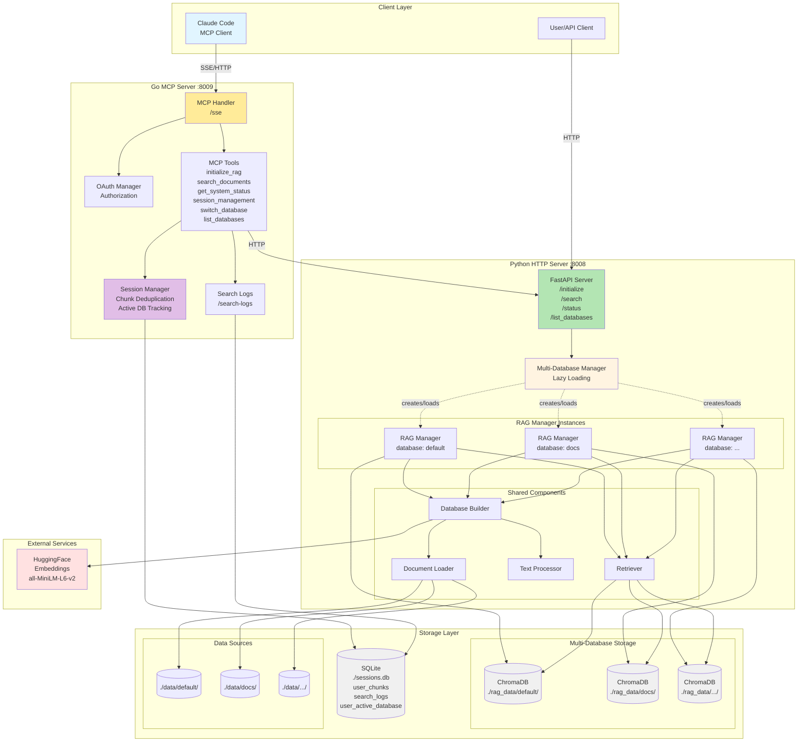

## Component Class Diagram

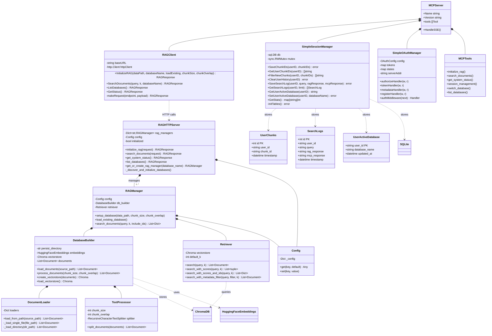

## Sequence Diagram - Full Search Flow with Multi-Database Support

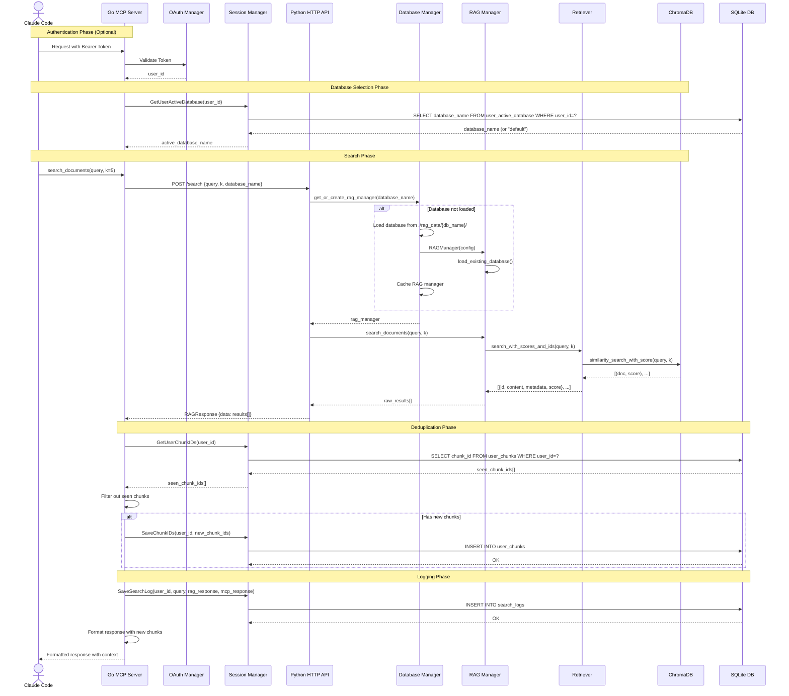

## Sequence Diagram - Database Switch Flow

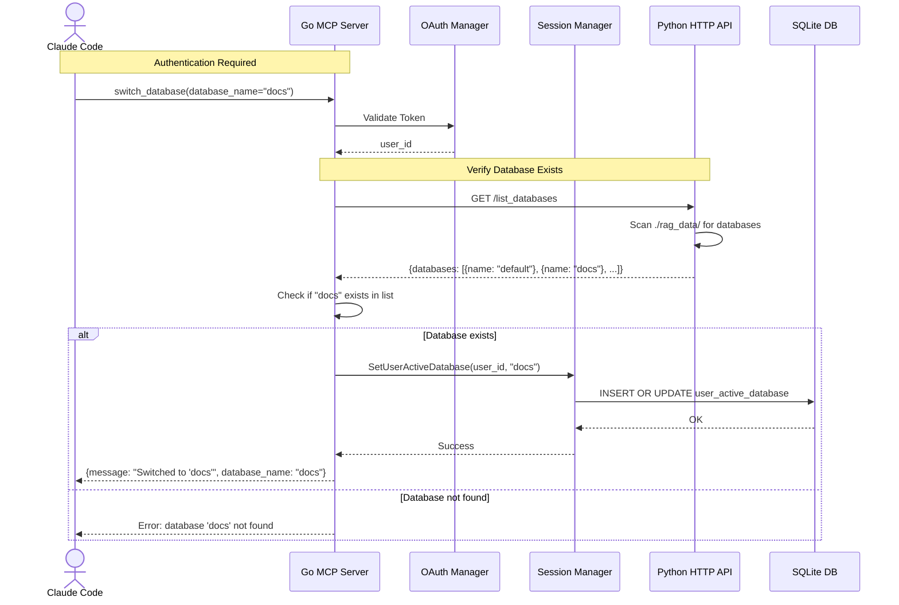

## Sequence Diagram - Database Initialization with Multi-DB

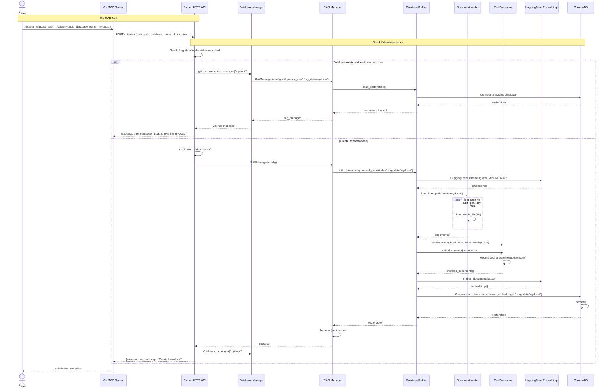

## Sequence Diagram - Auto-Discovery on Startup

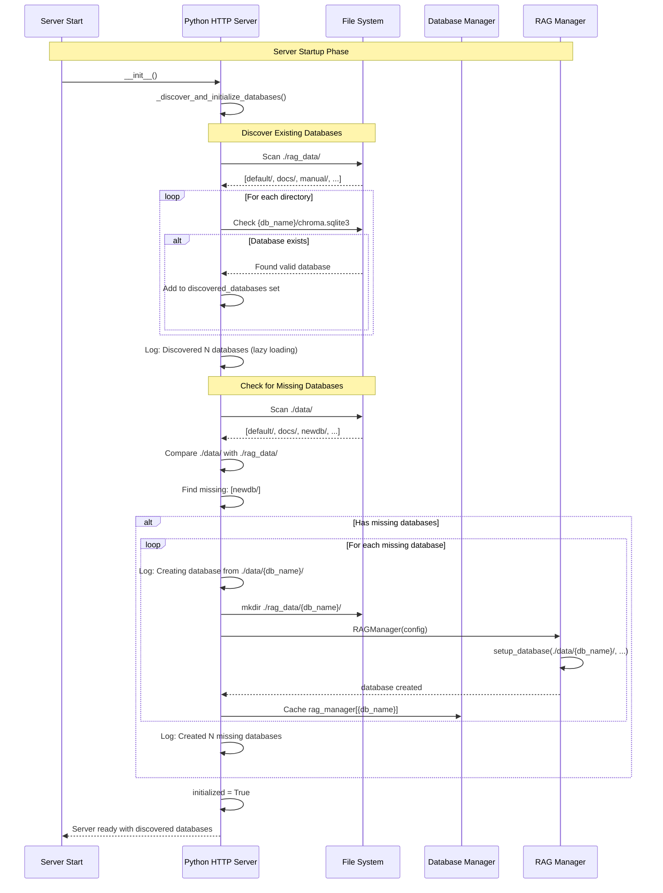

## OAuth 2.1 Flow Diagram

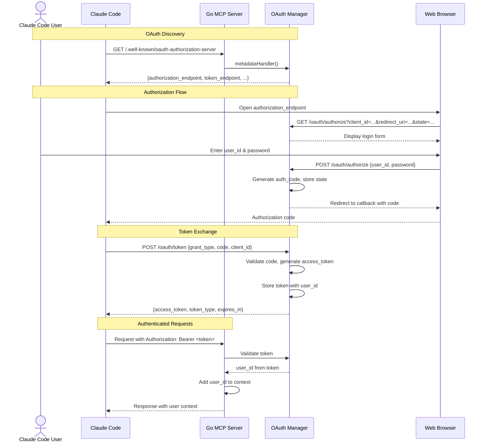

## Data Flow Diagram

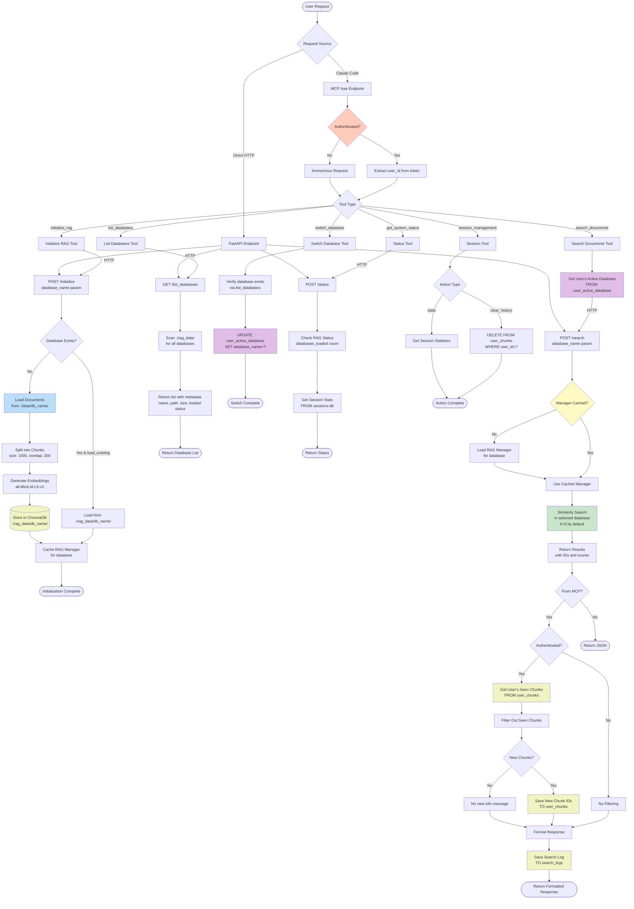

## State Diagram - System States with Multi-Database

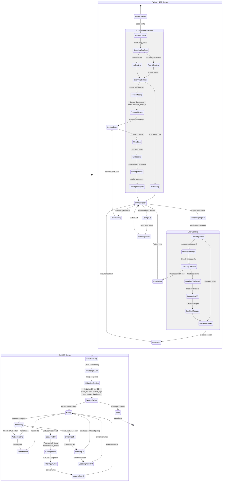

## Deployment Architecture

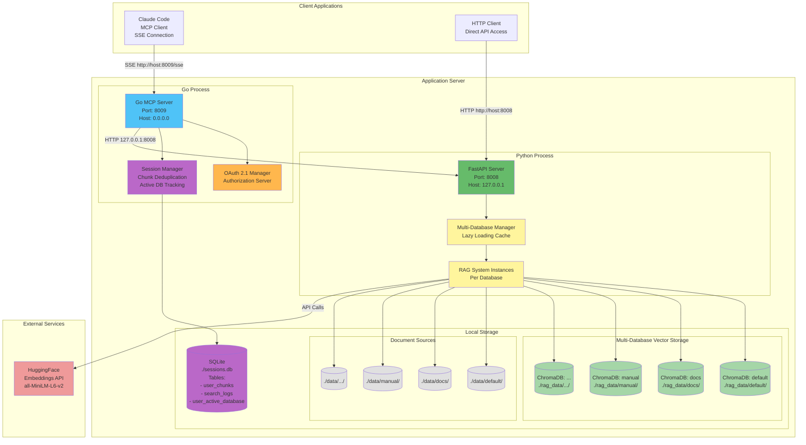

## Database Schema

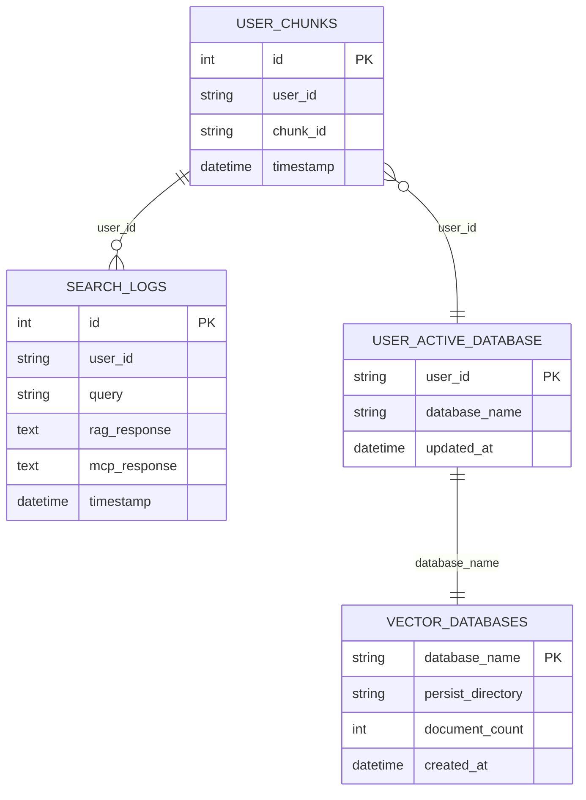

## Key Features Overview

### 1. **Dual Server Architecture**
- **Go MCP Server** (Port 8009): MCP protocol handler, OAuth 2.1, session management
- **Python HTTP Server** (Port 8008): RAG system, vector search, document processing

### 2. **Multi-Database Support** 🆕
- **Multiple Vector Databases**: Each database stored separately in `./rag_data/{database_name}/`
- **Per-User Active Database**: Each user can switch between databases
- **Lazy Loading**: Databases loaded on-demand to save memory
- **Auto-Discovery**: Automatically discovers existing databases on startup
- **Database Management Tools**:
  - `list_databases`: List all available databases
  - `switch_database`: Switch user's active database

### 3. **Database Structure** 🆕
- **New Structure**: `./data/{database_name}/` → `./rag_data/{database_name}/`
- **Legacy Support**: `./data/` → `./rag_data/default/`
- **Auto-Creation**: Missing databases automatically created from `./data/` on startup

### 4. **OAuth 2.1 Authentication**
- MCP-compliant OAuth 2.1 implementation
- Authorization code flow with PKCE
- OAuth discovery metadata endpoints
- Dynamic client registration

### 5. **Session Management**
- **Chunk Deduplication**: Tracks which chunks user has seen (across all databases)
- **Active Database Tracking**: Stores user's current active database 🆕
- **Search Logging**: Records all search queries and responses
- **SQLite Storage**: Persistent storage in `sessions.db` with 3 tables

### 6. **RAG Pipeline**
- **Document Loading**: txt, pdf, csv, md files
- **Text Processing**: 1000-char chunks with 200-char overlap
- **Vector Embeddings**: HuggingFace all-MiniLM-L6-v2
- **Vector Search**: ChromaDB with cosine similarity

### 7. **MCP Tools**
- `initialize_rag`: Setup vector database from documents (with database_name parameter) 🆕
- `search_documents`: Search with deduplication and logging (uses user's active database) 🆕
- `get_system_status`: System health and statistics (shows loaded databases count) 🆕
- `session_management`: Clear history, get stats
- `switch_database`: Switch user's active database 🆕
- `list_databases`: List all available databases 🆕

### 8. **Data Flow**
1. Claude Code → Go MCP Server (with OAuth)
2. Go validates token, extracts user_id
3. Go gets user's active database from session manager 🆕
4. Go → Python HTTP API for RAG search (with database_name) 🆕
5. Python lazy-loads RAG manager for requested database 🆕
6. Python returns results with chunk IDs
7. Go filters seen chunks (per user, across all databases)
8. Go saves new chunks and logs search
9. Go returns formatted response to Claude

### 9. **Performance Optimizations** 🆕
- **Manager Caching**: RAG managers cached after first load
- **Lazy Loading**: Databases only loaded when accessed
- **Memory Efficiency**: Only active databases kept in memory

## Changes from Previous Version

### Added Features:
1. ✅ Multi-database support with per-user active database
2. ✅ Database auto-discovery on startup
3. ✅ Lazy loading of RAG managers
4. ✅ New MCP tools: `switch_database`, `list_databases`
5. ✅ New SQLite table: `user_active_database`
6. ✅ Database name parameter in all relevant endpoints
7. ✅ Support for both new and legacy data structures

### Updated Components:
1. 🔄 `RAGHTTPServer`: Now manages multiple RAG instances
2. 🔄 `SimpleSessionManager`: Added database tracking methods
3. 🔄 `RAGClient`: Added database_name parameters
4. 🔄 All sequence diagrams to reflect database selection
5. 🔄 Data flow diagram with database routing
6. 🔄 State diagram with auto-discovery and lazy loading states
7. 🔄 Deployment architecture with multi-database storage

### Architecture Improvements:
- Better separation of concerns with Database Manager layer
- Scalable multi-tenant design with per-user database selection
- Efficient resource usage through lazy loading
- Automatic database provisioning from source files
